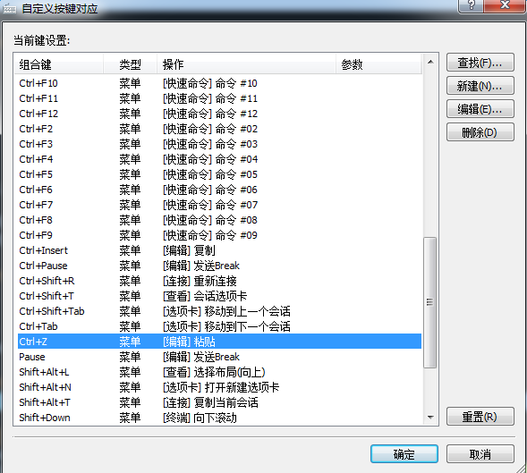

# 关于Vim的配置及实用操作
by Yankees
***
## 1. vim配置文件目录树
	.vim    ---------------------------->vim的插件及脚本文件夹  
	├── autoload    ---------------->自动加载目录  
	│   ├── airline  
	│   └── airline.vim  
	├── bin    ---------------------->脚本目录  
	│   └── tag  
	├── colors    ------------------->存放了vim的主题目录  
	│   └── molokai.vim  
	├── doc    ------------------->帮助文档目录  
	│   └── airline.txt  
	├── nerdtree_plugin  
	│   ├── exec_menuitem.vim  
	│   └── fs_menu.vim  
	├── plugin    ------------------>插件目录  
	│   ├── airline.vim  
	│   ├── autoload_cscope.vim  
	│   ├── comment.vim  
	│   ├── NERD_tree.vim  
	│   ├── supersearch.vim  
	│   └── taglist.vim  
	└── syntax  
	     └── nerdtree.vim  
	.vimrc    ------------------------>vim配置文件

安装步骤:  
（1）、将附件`res/vim/vim_cfg.tar.gz`拷贝至根目录  
命令：`tar -xvzf vim_cfg.tar.gz`  
（2）、加入环境变量，用于执行bin目录下的脚本  
命令：`vi ~/.bashrc`  
添加环境变量：`export PATH="/home/yankees/.vim/bin:$PATH"`   注意改成自己的用户路径  
添加脚本的执行权限：`chmod +x ~/.vim/bin/tag`  
保存退出执行命令：`source ~/.bashrc`  
这样就完成了vim的配置  
下面具体说一下如何使用

## 2. vim配置的使用方法  
 .vimrc是vim的配置文件，每次启动vim的时候，会先执行它，所以可以把自己的一些编程及视图习惯提前配置好，提高编程及阅读代码的效率。  
 由于vim功能十分强大，配置也十分复杂，我针对讲解一些我自己常用的配置项，供给大家参考。  
\----------------------------------------------------------------------------------------------------  
**先讲解一下vim的一些基本配置：**  
`set expandtab`        这个功能是将tab自动转成空格，merge的时候经常遇到这个问题，所以可以提前配置好,  set noexpandtab则反之。  
`set shiftwidth=4`      这个是用于程序中自动缩进所使用的空白长度指示的。一般来说为了保持程序的美观，和下面的参数最好一致。  
`set tabstop=4`         定义tab所等同的空格长度，一般来说最好设置成8，因为如果是其它值的话，可能引起文件在打印之类的场合中看起来很别扭。除非你设置了 expandtab模式，也就是把tabs转换成空格，这样的话就不会一起混淆。  
`set softtabstop=4`    shiftwidth和tabstop不一样的话，你会发现程序比较难看的。这时候，softtabstop就起作用了  
可以从vim的说明中看到，一旦设置了softtabstop的值时，你按下tab键，插入的是空格和tab制表符的混合，  
具体如何混合取决于你设定的softtabstop，举个例子，如果设定softtabstop=8, 那么按下tab键，插入的就是正常的一个制表符;  
如果softtabstop=16，那么插入的就是两个制表符；如果softtabstop=12,那么插入的就是一个制表符加上4个空格；  
如果 softtabstop=4，那么一开始，插入的就是4个空格，此时一旦你再按下一次tab，这次的四个空格就会和上次的四个空格组合起来变成一个制表符。换句话说，softtabstop是“逢8空格进1制表符”,前提是你tabstop=8  
个人习惯，一般情况我将上面三个参数设置成4个空格。也可以autocmd FileType c,cpp set shiftwidth=4 | set expandtab，这样就在c和c++的文件里面使用。  
\----------------------------------------------------------------------------------------------------  
`set mouse=a`         定义了是否支持鼠标的功能，a表示all modes。不设置该项，默认不支持鼠标。
对于vim不熟悉的人，还是习惯用鼠标选择目标，但是在使用xshell的时候，使能了鼠标功能，就会导致无法复制选中的内容，所以我的配置项里面，是关闭了这个功能的，需要的自行开启。  
`set autoindent/set cindent`        定义了自动的缩进方式，当拷贝大段代码到vim里面的时候，需要关闭这两个配置项，不然会导致缩进混乱。  
`colorscheme molokai`        定义了vim的配色方案，molokai是比较经典的配色方案，配色的文件在colors目录下面，大家可以根据喜好进行修改。  
`filetype on`             开启文件类型的自检功能，用于识别文件类型  
\----------------------------------------------------------------------------------------------------  
**下面给大家讲一下插件的配置及使用：**  
`noremap <F5> :TlistToggle <CR>`      映射了F5按键，按F5开启\关闭 taglist插件，该插件用树目录显示当前源码文件的宏定义、变量、函数名等。需要确保服务器安装了ctags工具。  
`map <F6> :NERDTreeToggle<CR>`    映射了F6按键，按F6开启\关闭nerdtreed插件，该插件用树目录显示文档目录。  
`map <F7> :NERDTreeFind<CR>`       映射了F6按键，按F7开启nerdtreed插件，用树目录显示当前文件的路径。  
开启NERDTree以后，可以使用Bookmark标记自己常用的目录或者文件，这样下次就可以直接进入，不需要一级一级目录进入了。  
设置路径：.vim/plugin/comment.vim  
`map <F3> :call TitleDet()<cr>'s`          映射了F3按键，按F3更新源码的头注释。  
`map <F4> :call AddFunTitle()<cr>'s`   映射了F4按键，按F4插入一个函数的头注释。  
\----------------------------------------------------------------------------------------------------  
**接着讲一下脚本的使用方法：**  
a、实现source insight的函数、宏等搜索及跳转  
（1）、首先确保服务器安装了ctags和cscope两个工具；  
（2）、在自己的常用目录下面创建一个文件top（命令：touch top），这个文件是用于定位自定义的一个根目录路径；  
（3）、vim进入top同级或者下一级任意文件（不是文件夹），按F12创建搜索标签，目录树越深，创建的速度越快，等tags创建完成，就可以使用了；  
（4）、一般有两种使用方法：  
查看函数的实现方法，或者结构体的定义等，可以通过选中相应的函数或者变量，跳转【Ctrl + ]】，回退【Ctrl + t】；  
复杂的用法，比如需要看那些函数调用了某个函数，或者那些文件使用了这个函数，可以通过cs命令来实现，我已经做了映射，如下：  

	noremap <C-f>s :cs find s <C-R>=expand("<cword>") <CR><CR>  
	noremap <C-f>g :cs find g <C-R>=expand("<cword>")<CR><CR>    
	noremap <C-f>c :cs find c <C-R>=expand("<cword>") <CR><CR>
	noremap <C-f>t :cs find t <C-R>=expand("<cword>") <CR><CR>
	noremap <C-f>e :cs find e <C-R>=expand("<cword>") <CR><CR>
	noremap <C-f>f :cs find f <C-R>=expand("<cfile>") <CR><CR>
	noremap <C-f>i :cs find i ^<C-R>=expand("<cfile>")<CR>$<CR>
	noremap <C-f>d :cs find d <C-R>=expand("<cword>") <CR><CR>

可以根据个人的喜好映射按键，我的映射方法是【Ctrl +f】然后按s、g等等，具体对应的功能可以在vim命令模式输入：cs即可。
（5）、当自己编写的函数、宏、变量等，需要按F12更新你的搜索标签，一段时间更新一次即可。  
我一般会在kernel的同级目录创建top文件，创建标签的时间会长一点，但是搜索的速度非常快。

## 3、vim的常用快捷键操作
**a、光标移动**  
h：左移一格     j：下移一格  
l：右移一格      k：上移一格  
0：跳转到当前行最左格      ^：跳转到当前行第一个字符  
$：跳转到当前行最后一个字符  
gg：跳转到当前文件第一格  
G:跳转到当前文件最后一字符  
%：可以在函数的{}或（）之间跳转  
Ctrl+d：屏幕上移整页     Ctrl+d：屏幕下移整页  
Ctrl+u：屏幕上移半页     Ctrl+d：屏幕下移半页 这两个我在review代码时用的最多
命令行输入行数直接跳到指定行  
当查看log时候，需要搜索某个指定的函数或者变量时，如图：

**b、插入和删除**  
i：在当前字符的左边插入     I：在当前行首插入  
a：在当前字符的右边插入      A：在当前行尾插入  
o：在当前行下面插入一个新行     O：在当前行上面插入一个新行  
dd：删除一行      ndd：n代表删除的行数（eg: 4dd，删除光标行算起的下4行）  
yy：复制一行       nyy：n代表复制的行数（eg: 4yy，复制光标行算起的下4行）  
p：粘贴到光标右侧 P：粘贴到光标左侧  
多行批量操作（注释、相同内容的插入）  
首先【Ctrl+v】进入可视模式，选中多行要插入的位置，接着按【I】，输入内容（eg:"//"）,最后按【Esc】。  

**c、搜索**  
\#/*：文件中相同字符串的搜索，一个向下，一个向上  
n/N：跳转到下一个相同字符串，一个向下，一个向上  

**d、其他常用操作**  
gd：跳转到当前变量第一次定义处  
u：撤销     【ctrl+r】：反撤销  
R：替换字符串，不需要进入insert模式  
【ctrl+w】+w/b/h：多个屏幕之间进行切换  
批量替换  
语法格式：【:[addr]s/源字符串/目的字符串/[option]】  
[addr] 表示检索范围，省略时表示当前行。  
“1,20” ：表示从第1行到20行；  
“%” ：表示整个文件，同“1,$”；  
“. ,$” ：从当前行到文件尾；  
s：表示替换操作  

[option]：表示操作类型  
g 表示全局替换;   
c 表示进行确认  
p 表示替代结果逐行显示（Ctrl + L恢复屏幕）;  
省略option时仅对每行第一个匹配串进行替换;  
如果在源字符串和目的字符串中出现特殊字符，需要用”\”转义 如 \t  
我用的最多的就是去掉行尾^M【:%s/\r//g】  
建议大家在Visual、Insert、Normal、Cmd几种模式之间切换的时候，使用【Ctrl+c】进行退出操作，会比【Esc】更快捷。   

**e、操作总结**by braden  
`set paste` 在插入模式下粘贴内容，不会有混乱的缩进    
`new+窗口名` 新建窗口    
`split+窗口名` 横向切割窗口，亦可用sp+窗口名    
`vsplit+窗口名` 纵向切割窗口，亦可用vsp+窗口名    
`ctrl+w+w` 在打开的窗口间切换焦点    

附上一张键盘快捷键的映射图：  

## 4、xhell使用vim问题总结和使用技巧

**a、中文乱码，编码改选UTF-8**  

**b、插件一些符号显示有问题，例如：“▸”显示成“？”。替换支持的字体，我选用的是“DejaVu Sans Mono”**  

**c、建议xshell的设置，点击“工具”-->“选项”，可以如上设置，这样可以快速的拷贝和粘贴。**  

